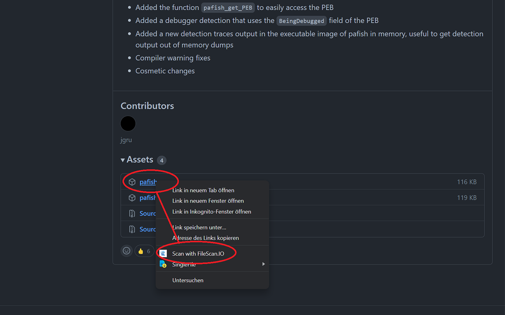
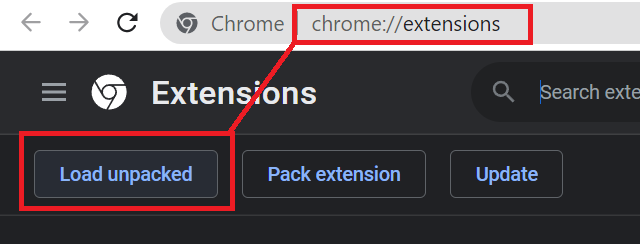
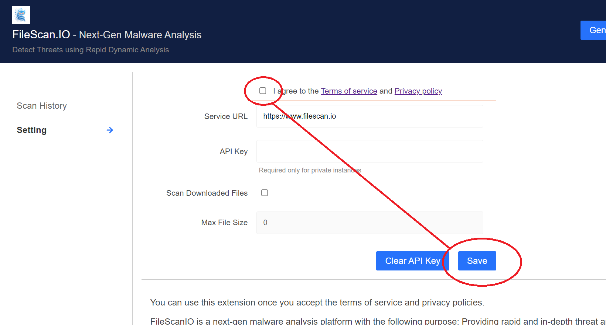

# FileScan.IO chrome extension

This is the official FileScan.IO chrome extension that allows on demand scanning of web URLs. Additionally, the extension can be configured to automatically scan downloaded files (off by default). All files are sent to the public community site at www.filescan.io. However, commercial customers that have their own private instance may configure the extension accordingly.

# Installation

1) Download the `build` folder.
2) Open chrome at `chrome://extensions/` and click `Load unpacked`

3) Select the `build` folder, read and accept the terms and hit `save`

Now you can right-click any link and/or will experience automated scanning of your downloads, if enabled.